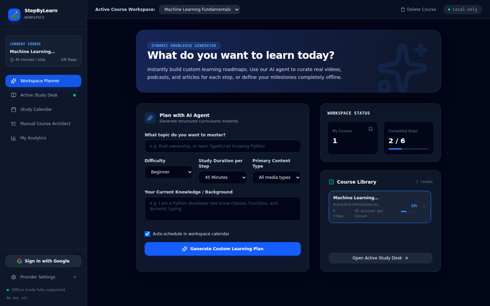
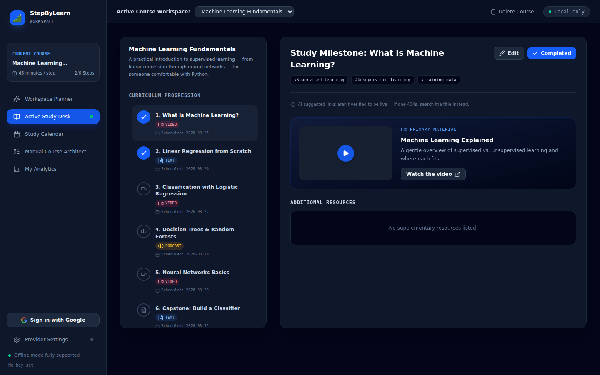
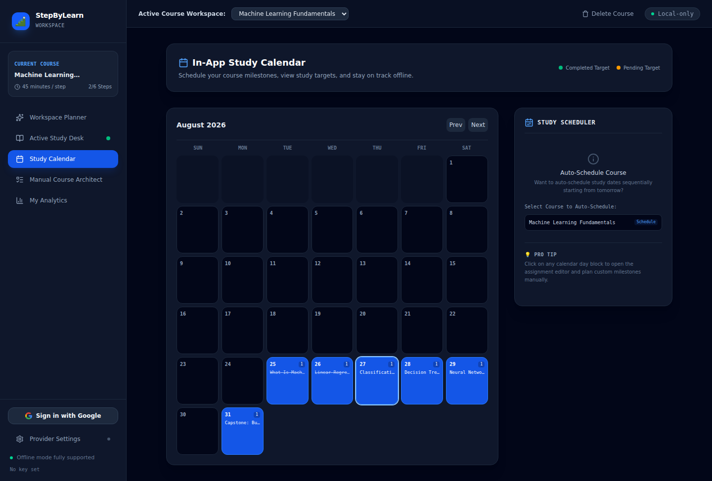
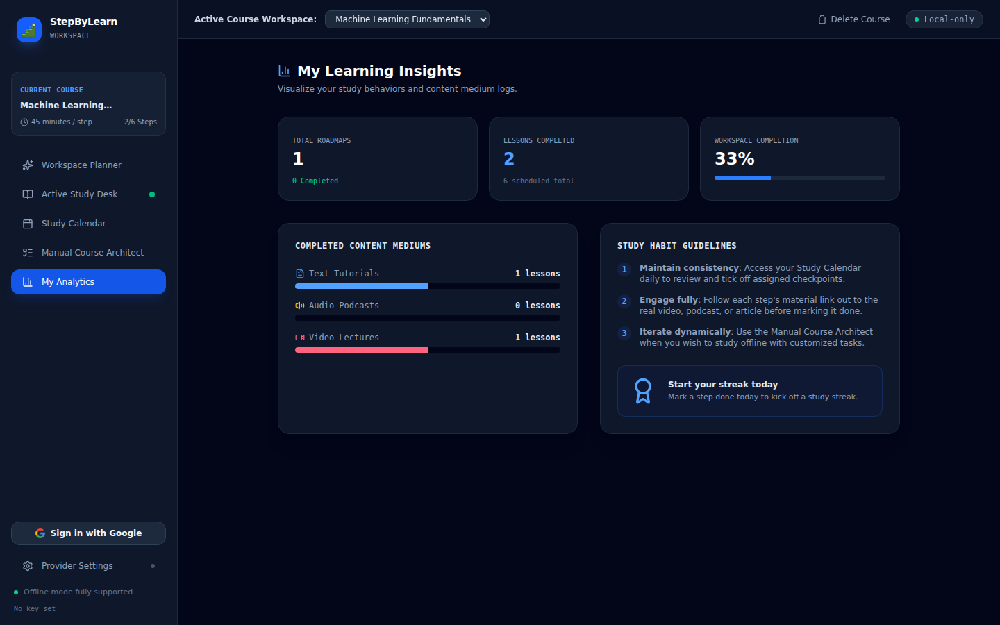
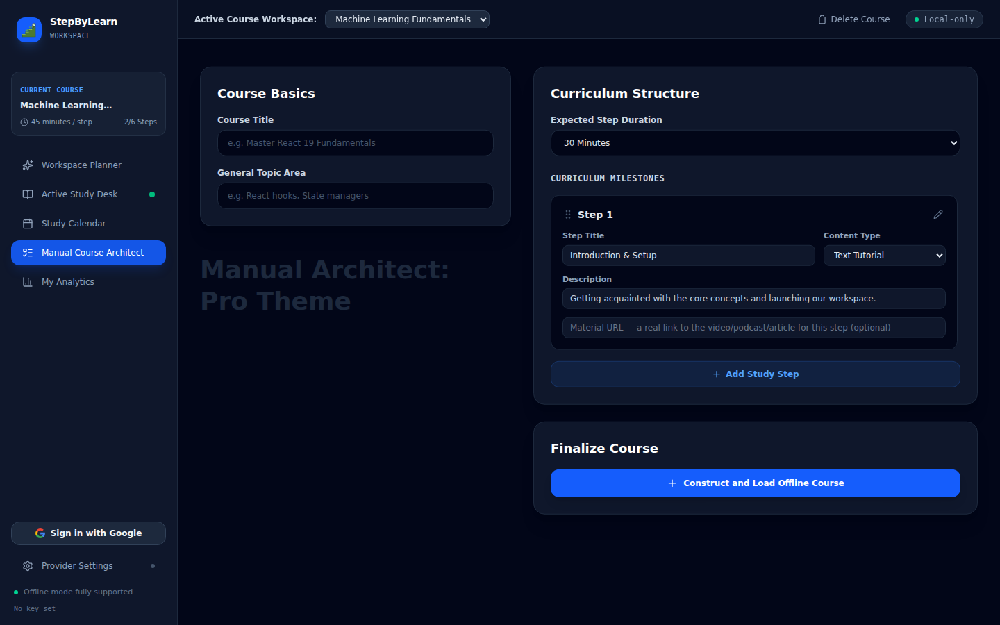
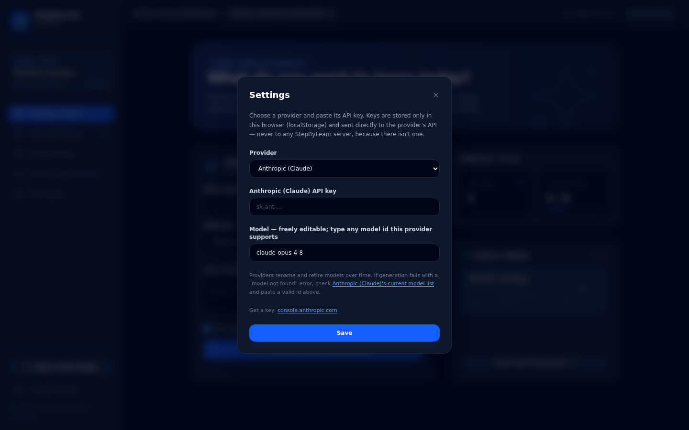

# StepByLearn

An **offline-first, cloud-AI, step-by-step learning platform** — a pure browser
web app. Generate a structured learning path for any topic with your choice of
Anthropic Claude, OpenAI, Groq, or Google Gemini, schedule it onto a calendar,
and track your progress. Everything is stored locally in your browser
(IndexedDB) for privacy and full offline use.

No backend, no server, no database to install. Just `npm install && npm run dev`.

## Screenshots

**Workspace Planner** — describe a topic, your level, and your background, and
generate a full curriculum; the sidebar tracks every course you've built:



**Active Study Desk** — work through a path step by step, with key concepts,
the primary material link, and any extra resources for the step in view:



**Study Calendar** — every scheduled step lands on its date, so a course reads
as a plan instead of a checklist:



**My Analytics** — lessons completed, content medium breakdown, and overall
course progress:



**Manual Course Architect** — skip AI generation entirely and hand-build a
curriculum step by step:



**Settings** — pick a provider and paste your own API key; it's stored only in
your browser and sent straight to that provider, never to a StepByLearn server
(there isn't one):



To regenerate these images locally:

```bash
npm run dev -- --port 5173 --strictPort   # in another terminal
npx playwright test e2e/screenshots.spec.ts
```

## Highlights

- **Pure web app** — Vite + React + TypeScript. Runs from `npm run dev` or
  deploys as a static site to any host (Netlify, Vercel, GitHub Pages, S3…).
- **Local-first storage** — all paths, steps, calendar dates, and progress live
  in the browser's **IndexedDB** (via Dexie). Nothing is sent to a server.
- **Cloud AI, your choice of provider** — generation calls **Anthropic, OpenAI,
  Groq, or Gemini directly from the browser**, using a key you paste into
  Settings (stored only in your browser). No server, no vendor SDK — backed by
  the shared [`@joka-7/modeldispatcher-browser-agent`](https://github.com/joka-7/ModelDispatcher/tree/main/clients/browser-agent)
  package (also used by JobFlowTracker/KanDOne/HighFive).
- **Resilient parsing** — a defense-in-depth JSON healer cleans fragile model
  output (code fences, prose, stray text) into validated domain models.
- **Fully offline after generation** — browsing paths, marking steps done,
  scheduling, and progress/streaks all work with no network.

## Architecture

Layered with a single direction of dependency:

```
components → services → { ai, repositories } → domain
```

- `src/domain` — pure types + id generation (no I/O).
- `src/db` + `src/repositories` — Dexie/IndexedDB persistence behind repository
  functions (swap storage without touching the rest).
- `src/ai` — the resolver (backed by `@joka-7/modeldispatcher-browser-agent`,
  the shared multi-provider browser client), prompts, and the JSON healer.
- `src/services` — use-cases: generation, calendar scheduling, progress.
- `src/components` + `src/App.tsx` — React UI, reactive via Dexie live queries.

See [`docs/HLD.md`](docs/HLD.md) and [`docs/LLD.md`](docs/LLD.md) for the full design, and
[`docs/STRUCTURE.md`](docs/STRUCTURE.md) for the annotated file tree:

<!-- BEGIN GENERATED TREE (depth=1 entries=all) -->
```text
StepByLearn/
├── .github/
├── docs/
├── e2e/
├── legacy-python/  # Earlier FastAPI + SQLite implementation, kept for reference only — not part…
├── public/         # Static assets + PWA manifest
├── src/
├── .ai             # Ogen-ai submodule — the shared source of rules, skills and the ai-sync…
├── .env.local.example
├── .gitignore
├── .gitmodules
├── .npmrc
├── .prettierignore
├── .prettierrc
├── AGENTS.md       # The compiled coding rules every AI assistant reads — generated, do not…
├── CLAUDE.md       # Claude Code's copy of AGENTS.md (generated)
├── GEMINI.md       # Gemini CLI's copy of AGENTS.md (generated)
├── LICENSE
├── README.md       # StepByLearn
├── ai-config.toml  # Which rule fragments and target tools ai-sync compiles for this repo
├── eslint.config.js
├── firestore.rules
├── index.html
├── package-lock.json
├── package.json
├── playwright.config.ts
├── tsconfig.json
├── vercel.json
├── vite.config.ts
└── vitest.config.ts
```
<!-- END GENERATED TREE -->

## Quick start

```bash
npm install
npm run dev        # opens http://localhost:5173
```

Then click **Settings** (top-right), pick a provider (Anthropic, OpenAI, Groq,
or Gemini), paste its API key, and generate a path. Each provider's console
link and key format are shown right in the Settings panel.

### Build / deploy

```bash
npm run build      # outputs static files to dist/
npm run preview    # serve the production build locally
```

Deploy the contents of `dist/` to any static host.

## Privacy & the API key

This is a single-user, local-first tool. Your API key is stored in the browser's
`localStorage` and sent **only** to your chosen provider's own API on the direct
generation call — there is no StepByLearn server to receive it. Because you
supply your own key on your own machine, a direct browser-to-provider call is
an acceptable trade-off for a zero-backend app.

## Scripts

| Script                 | Purpose                          |
| ---------------------- | -------------------------------- |
| `npm run dev`          | Start the dev server             |
| `npm run build`        | Type-check and build to `dist/`  |
| `npm run preview`      | Serve the built site             |
| `npm run typecheck`    | Type-check only                  |
| `npm run lint`         | Lint with ESLint                 |
| `npm run format`       | Format with Prettier             |
| `npm run format:check` | Check formatting without writing |
| `npm test`             | Run the unit test suite (Vitest) |
| `npm run test:watch`   | Run tests in watch mode          |
| `npm run test:e2e`     | Run end-to-end tests (Playwright) |

## Legacy Python implementation

An earlier Python (FastAPI + SQLite) implementation of the same concepts lives in
[`legacy-python/`](./legacy-python) and in git history. It's kept for reference
and can be deleted if you don't need it.

## License

See [LICENSE](LICENSE).
