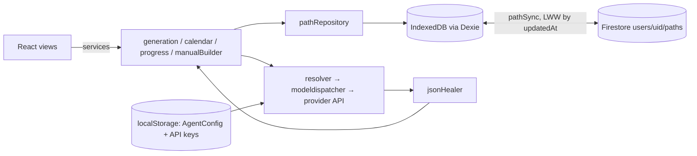

# StepByLearn — Full Audit (October 2026)

Audit of `main` @ `b6db1fe`, plus the `.ai` submodule (ogen-ai @ `60b2d7b`) that supplies
the rules, skills, commands and role agents. Every claim below cites a file or a command
that was actually run; items marked **(reproduced)** were confirmed by running code.

**How it was checked:** `npm ci`, `npm run typecheck`, `npm run lint`, `vitest --coverage`,
`npm run build`, `npm audit --omit=dev`, the ogen-ai unittest suite, `ai-sync --dry-run`,
and GitHub Actions run history on `main`. Then the source files were read one by one.

## 1. Headline

| Area                              | State                                                           | Most important action                                    |
| --------------------------------- | --------------------------------------------------------------- | -------------------------------------------------------- |
| Build / types / lint / unit tests | ✅ green (44 tests)                                             | —                                                        |
| Security CI on `main`             | ❌ **red** for several pushes (`npm audit` 4 high)              | Add an `overrides` pin for `@grpc/grpc-js` (see §4.1)    |
| Cloud sync (Firestore)            | ⚠️ **can lose data, can leak data across accounts**             | Fix `src/firebase/pathSync.ts` (§3.1, §3.2)              |
| Dates (calendar, streaks)         | ⚠️ 3 timezone/month bugs **(reproduced)**                       | Use local-date helpers everywhere (§3.3–3.5)             |
| Test coverage                     | ⚠️ 25% statements, no UI or sync tests                          | Test `pathSync`, `calendar`, components (§7)             |
| Accessibility                     | ⚠️ modals lack dialog semantics, focus, Esc                     | Add a shared `<Modal>` (§5)                              |
| Role agents                       | ⚠️ **not installed** in this repo, but their slash commands are | Enable `claude_agents` or stop shipping `/role-*` (§2.2) |
| Mobile (Android/iOS)              | 🟢 PWA today; Capacitor wrap is ~1–2 weeks                      | See §9                                                   |

## 2. Skills, rules and role agents (the `.ai` submodule)

### 2.1 What is actually wired into this repo

`ai-config.toml` targets `claude, cursor, gemini, copilot` with `link_mode = "copy"` and does
**not** set `claude_agents = true`. `ai-sync --dry-run` confirms: `AGENTS.md`/`CLAUDE.md`/
`GEMINI.md`/copilot instructions are current (byte-identical to a fresh generation), skills
and commands are copied into `.claude/` (gitignored), and **no `.claude/agents/`** is written.

Consequences:

- `/role-review`, `/role`, `/role-implement`, `/sync-tracker`, `/sync-docs` are installed as
  commands, but the 11 agents they launch are not. Running them fails or degrades into the
  main agent role-playing. **Fix:** set `claude_agents = true` in `ai-config.toml`, or teach
  `ai-sync` to skip role commands when agents are off.
- The `verification` practice fragment (newest rule, ogen-ai `60b2d7b`) is not opted into.
  `practices` in `ai-config.toml` should add `"verification"`.
- Every skill is copied, including ones irrelevant to a TypeScript SPA
  (`scaffold-python-service`, `port-module-to-ts`). Their descriptions load every session and
  can trigger on unrelated prompts. **Fix (ogen-ai):** a `[skills] include/exclude` list in the
  manifest.

### 2.2 Role agents — verdict per role

| Role                  | Model  | Tools                      | Verdict          | Pros                                                            | Cons / update                                                                                                                                                                                                                      |
| --------------------- | ------ | -------------------------- | ---------------- | --------------------------------------------------------------- | ---------------------------------------------------------------------------------------------------------------------------------------------------------------------------------------------------------------------------------- |
| `architect`           | opus   | Read/Grep/Glob/Bash        | **Keep**         | Judges against the repo's own scale; flags over-engineering too | —                                                                                                                                                                                                                                  |
| `ciso`                | opus   | no Bash                    | **Keep**         | Structurally cannot run untrusted code                          | Can't run `npm audit`, so it missed the red Security CI here; tell it to read the latest CI result or `audit_data.json` deps                                                                                                       |
| `qa`                  | sonnet | Bash                       | **Keep, update** | "Would this catch a regression" framing is right                | Runs the target's test suite = executes untrusted code, which contradicts the `ciso` stance. Gate the run behind "trusted repo"                                                                                                    |
| `senior-dev`          | opus   | Bash                       | **Keep**         | Requires a concrete failing input per finding                   | Overlaps the built-in `/code-review`; say when to use which                                                                                                                                                                        |
| `product`             | sonnet | Bash                       | **Keep**         | Docs-vs-code drift is high-value (it would catch §6.4 here)     | Doesn't cover UI flows or accessibility — see the missing `ux` role                                                                                                                                                                |
| `engineering-manager` | sonnet | Bash                       | **Keep**         | Cheap, metadata-only                                            | For a solo repo most findings are `info`; fine                                                                                                                                                                                     |
| `sre`                 | sonnet | Bash (fenced)              | **Update**       | Good server lens                                                | "Never walk `src/`" plus server-only checklist means a static SPA + Firebase app gets almost nothing: no bundle size, no offline/service-worker, no Firestore quota/cost lens. Add a client/serverless section                     |
| `planner`             | opus   | no Bash                    | **Keep**         | Dedupe rules are concrete and good                              | —                                                                                                                                                                                                                                  |
| `developer`           | opus   | Edit/Write                 | **Keep**         | Scope-locked to approved items, test-first                      | —                                                                                                                                                                                                                                  |
| `tracker`             | sonnet | Atlassian MCP              | **Update**       | Never invents tickets; idempotent marker                        | Hardcodes tool names `mcp__atlassian__*`. In this very environment the connected server is `Atlassian_Rovo` (`mcp__Atlassian_Rovo__*`), so **none of its tools resolve**. Make the alias a manifest option that `ai-sync` rewrites |
| `docs-sync`           | sonnet | Edit/Write + Atlassian MCP | **Update**       | Doc-only scope, asks before new pages                           | Same alias problem as `tracker`                                                                                                                                                                                                    |

**Missing roles worth adding:**

- **`ux`** (accessibility, flows, copy, empty and error states). Most of the UI findings in §5
  fall between `product` and `senior-dev` today.
- **`mobile`/platform** (optional). Checks PWA manifest quality, offline behavior, and
  app-store blockers. Only worth it if §9 goes ahead.
- **Privacy** belongs inside `ciso`: PII inventory, data export/delete, GDPR. Today no role
  asks "can a user delete their cloud data?" (§4.4).

**Delete:** none. All roles are coherent. The problems are wiring and coverage, not the
role set.

### 2.3 Skills — verdict per skill

| Skill                     | Verdict               | Notes                                                                                                                                                                                |
| ------------------------- | --------------------- | ------------------------------------------------------------------------------------------------------------------------------------------------------------------------------------ |
| `repo_tree`               | **Keep**              | Actually enforced here by `.github/workflows/docs.yml`. Best-integrated skill                                                                                                        |
| `role_review`             | **Keep**              | Shared schema is what makes the planner's dedupe possible                                                                                                                            |
| `audit_repo`              | **Keep, update**      | Useful mechanical pre-scan. See the name/dir mismatch below                                                                                                                          |
| `write-design-doc`        | **Keep**              | `docs/HLD.md`/`LLD.md` exist and follow it                                                                                                                                           |
| `conventional-commit`     | **Keep**              | The repo's history follows it                                                                                                                                                        |
| `lesson-capture`          | **Keep**              | Points at `ai-config.local.md`, which this repo has configured but not created. It will be created on first use, which is fine                                                       |
| `release-checklist`       | **Keep, start using** | Repo is stuck at `0.1.0` with no tags or CHANGELOG                                                                                                                                   |
| `customize_config`        | **Merge**             | A third config file (`ai-project-config.toml`) next to `ai-config.toml` and `ai-config.local.md` is confusing. Fold its `[audit.weights]` and `[rules.custom]` into `ai-config.toml` |
| `port-module-to-ts`       | **Exclude here**      | Port already done. Keep in ogen-ai, but don't ship it to this repo                                                                                                                   |
| `scaffold-python-service` | **Exclude here**      | Not relevant to a TS SPA                                                                                                                                                             |

**Cross-cutting skill issues (ogen-ai):**

- **Frontmatter `name` doesn't match the directory** for `audit_repo` (`audit-repo`),
  `repo_tree` (`repo-tree`), `role_review` (`role-review`) and `customize_config`
  (`customize-config`). The Agent Skills spec expects the two to match, and agents load
  "the `role-review` skill" by name, so a stricter loader (Copilot/Cursor/Codex) may not
  find it. Rename the directories to the hyphenated form.
- **ogen-ai's own test suite fails when checked out as a submodule:**
  `test_structure_doc.TestRepoIsCurrent.test_generated_trees_are_not_stale` **(reproduced)**.
  The tree root label comes from the directory name (`.ai/` vs `ogen-ai/`). The test should
  pin the root name or skip when not run from a standalone clone.

### 2.4 Rules (`AGENTS.md`) vs reality

The compiled rules say things the code and config don't do. That trains agents to ignore
rules:

- **TS strictness:** the rules require `noUncheckedIndexedAccess` and
  `exactOptionalPropertyTypes`. `tsconfig.json` has neither. Turning them on gives
  **33 errors** today. Either fix them (recommended, mostly `arr[0]` accesses) or drop the
  rule via the local tail.
- **"Server state via TanStack Query", "structured logging, never `console.log`",
  "typed Result or exception hierarchy", "one composition root":** the app uses Dexie live
  queries (fine), `console.error` (`pathSync.ts:54,79`) and `alert()`
  (`Sidebar.tsx:58`, `CalendarView.tsx:77`). It uses module-level singletons (`db`,
  `firestore`, `auth`) rather than injection. For an app this size that's reasonable, but say
  so in `ai-config.local.md` so agents stop "fixing" it.
- **"Keys must never be array index":** violated at `ManualBuilderView.tsx:138` and
  `EditStepModal.tsx:267` (both removable lists, so React state can shift between rows), and
  `StudyView.tsx:215`, `DashboardView.tsx:477`.

## 3. Bugs found

### 3.1 Signing in can overwrite newer cloud data with stale local data — **high**

`src/firebase/pathSync.ts:44-51`: on start, `lastSynced` is empty, so the first local
emission pushes **every** local path to Firestore with `setDoc`, unconditionally. The
newer-wins check exists only on the pull side (`:73`). Scenario: a phone holds a week-old
copy, and the laptop has since updated the path. Signing in on the phone overwrites the
cloud with the stale copy. The pull side then sees `remote.updatedAt === lastSynced` and
skips, so the newer laptop data is gone everywhere.
**Fix:** wait for the first `onSnapshot`, then reconcile per id (newer wins), then start
pushing. Or push only when `local.updatedAt > remote.updatedAt`.

### 3.2 Shared browser leaks one account's courses into another — **high**

Sign-out stops the sync but leaves IndexedDB as is (`App.tsx:54-57`). When user B signs in
on the same browser, 3.1's initial push uploads all of user A's paths into
`users/B/paths`. **Fix:** on sign-out, offer "keep a local copy / clear this device". On
sign-in, if local data has never been synced to _this_ uid, ask before merging. Store the
owning uid with each path.

### 3.3 Calendar "Next month" skips months on the 29th–31st — medium **(reproduced)**

`CalendarView.tsx:41-46`: `setMonth(month + 1)` on Jan 31 gives **Mar 3**. February
is unreachable from the 31st. **Fix:** `new Date(y, m + direction, 1)`.

### 3.4 "Starting tomorrow" is sometimes today — medium **(reproduced)**

`CalendarView.tsx:73` and `DashboardView.tsx:61` use `tomorrow.toISOString().slice(0,10)`,
which is a UTC date. In Israel (UTC+3) between 00:00 and 03:00, "tomorrow" comes out as
**today**. West of UTC in the evening it skips a day. `services/calendar.ts` already has a
correct local `toISODate`. Export it and reuse it.

### 3.5 Streaks count the wrong day — medium **(reproduced)**

`services/progress.ts:62` buckets `doneAt.slice(0,10)` (UTC) but compares against a _local_
date. A step done at 01:30 Israel time is counted on the previous day, so late-night
learners lose their streak. **Fix:** convert `doneAt` with `new Date(t)` then use the local
`toISODate`.

### 3.6 Deleted courses come back — medium

There are no tombstones. If a path is deleted on device A while device B is offline, B
re-uploads it on reconnect (`pathSync.ts:46-50`), and it comes back everywhere. **Fix:**
soft-delete (`deletedAt`) and sync it, then garbage-collect.

### 3.7 Unvalidated cloud documents can crash the app — medium

`pathSync.ts:69` casts `change.doc.data() as LearningPath` and writes it straight to Dexie.
`normalizePath` (`pathRepository.ts:46`) then calls `raw.steps.map` and throws on a doc
without `steps`, which blanks the whole UI. Validate at the boundary. Reuse the
`jsonHealer` normalizers, which already do this for AI output.

### 3.8 Sync write failures are silent — medium

`void setDoc(...)` / `void deleteDoc(...)` (`pathSync.ts:41,48`) discard rejections: quota,
permission denied, or docs over Firestore's 1 MiB limit. The UI shows "synced" regardless
(`TopBar` `synced={Boolean(user)}`). Surface a sync status (synced / pending / error).

### 3.9 Mobile drawer leaves a phantom history entry — low

`useBackClose` pushes a history entry when the drawer opens. Closing via a nav item or the
backdrop (`Sidebar.tsx` `selectView` → `onCloseMobile`) never pops it, so the next Back press
does nothing. Route those closes through `closeViaHistoryBack()` as the hook's own doc
comment says.

### 3.10 Analytics "best streak" is per course, not per learner — low

`AnalyticsView.tsx:30` takes the max of per-path streaks. Studying course A today and
course B yesterday shows 1, not 2. Compute it over all paths' `doneAt` together.

### 3.11 Smaller defects

- The legacy API key is never removed after migration (`settingsRepository.ts:28-45`), so the
  key now lives in two `localStorage` entries. Delete `stepbylearn.apiKey.*` after a
  successful migration.
- `schedulePath` writes the whole path object it was handed (`calendar.ts:64`) outside a
  transaction. A sync pull that lands mid-call is overwritten. Use `updateStep`-style
  read-modify-write in a transaction.
- Generation can't be cancelled and has no timeout (`DashboardView.tsx:100-125`). Pass an
  `AbortSignal` through if the dispatcher supports it.
- If auto-schedule fails after a successful generation, the user sees "Generation failed"
  even though the path was saved (`DashboardView.tsx:113-120`).
- The loading copy "Cross-checking links against well-known, stable sources..." describes a
  step that doesn't exist. Nothing checks links. Remove it, or build it (§8).

## 4. Security

### 4.1 Security CI is red on `main` — high

The Security workflow failed on the last pushes and the weekly schedule. `npm audit`
reports 4 high, all from `firebase → @firebase/firestore → @grpc/grpc-js@1.9.16`.
The latest `@firebase/firestore` still pins `~1.9.0`, so bumping Firebase won't fix it.
grpc-js is used only by Firestore's **Node** build, not the browser bundle, so real exposure
is nil, but the gate is blocking. **Fix:** add `"overrides": {"@grpc/grpc-js": "^1.13.6"}`
to `package.json` and re-run `npm audit`, or add a documented, dated audit exception. Don't
leave the gate red: a red gate gets ignored, and the next real advisory slips through.

### 4.2 API keys in `localStorage` with no CSP — medium

Bring-your-own-key in the browser is a deliberate, documented trade-off (README "Privacy").
But then XSS means key theft, and the only CSP is `frame-ancestors 'self'` (`vercel.json`).
Add a real policy: `default-src 'self'; connect-src` limited to the four AI provider hosts,
the Firebase/Google hosts and `localhost:11434`; `script-src 'self'`; `object-src 'none'`;
`base-uri 'none'`. That makes exfiltrating a key much harder even if an injection lands.

### 4.3 User- and cloud-supplied URLs rendered as `href` without a scheme check — low

AI output is filtered to `http(s)` (`jsonHealer.ts` `asUrl`). Manual-builder, Add/Edit-step
and Firestore-pulled URLs are not. They go straight into `<a href>`
(`StudyMaterialTab.tsx:81,113,169`, `EditStepModal.tsx:339`). React 18 only _warns_ on
`javascript:` URLs. Today this is self-XSS only (users see only their own data), but it
becomes real the day sharing exists. Apply `asUrl` at every write boundary.

### 4.4 Firestore rules: owner-only, but no schema, size or abuse limits — medium

`firestore.rules` correctly restricts `users/{uid}/paths/{pathId}` to its owner. But:

- No field or size validation, so any signed-in client can write arbitrary documents. That
  is the root of the 3.7 crash risk and of storage-cost abuse.
- No **App Check**, so anyone holding the public Firebase config can script sign-ups and
  writes against your quota.
- No user-facing "delete my cloud data" or export. That's needed for GDPR and for app-store
  review (Apple requires in-app account deletion).

### 4.5 Good practices already in place

Actions are pinned by SHA. Gitleaks scans full history, alongside Trivy and CodeQL.
Dependabot covers npm, actions and the submodule. Firebase config comes from env and is
correctly called non-secret. Prompts embed user text via `JSON.stringify`, which limits
prompt-structure injection. `X-Frame-Options`, `nosniff` and `Permissions-Policy` are set.

## 5. GUI, UX and accessibility

**Accessibility (fix first, cheap):**

- Modals (`SettingsModal`, `AddStepModal`, `EditStepModal`) have no `role="dialog"`,
  `aria-modal`, labelled title, focus trap, initial focus, Escape-to-close, or focus return.
  The Settings close button (`SettingsModal.tsx:54`) has no accessible name. Build one
  shared `<Modal>` and reuse it.
- The path `<select>` in `TopBar.tsx` has no label. `AnalyticsView` and `StudyMaterialTab`
  have zero labels or ARIA.
- Text is mostly `text-[10px]`/`text-[11px]`/`text-xs` with `slate-500` on `slate-950`.
  That is below WCAG AA contrast and too small on phones. Raise body copy to ≥ 14px and
  use `slate-400` as the minimum.
- `alert()`/`confirm()` (`App.tsx:126`, `CalendarView.tsx:77`, `Sidebar.tsx:58`) block the
  page and look broken in an installed PWA. Use toasts and an in-app confirm dialog.

**Flows and features:**

- Auto-schedule is fixed to "start tomorrow, every day, no weekends skipped, no milestones",
  but `schedulePath` already supports `skipWeekends`, `daysBetween` and `milestoneEvery`.
  Expose them in a small scheduling dialog for a quick win.
- No search, filter or sorting in the course library. No step reordering. No undo for
  delete, which is a hard `confirm()` today. Use soft-delete with an Undo toast; this pairs
  with the 3.6 tombstones.
- There's no onboarding. A first-time user lands on a form that needs an API key. Add a
  3-step empty state: what this is, get a key (or use the free external-chat favorite), then
  generate. The Settings key explanation is good. Surface it earlier.
- The error message is raw `err.message` (`DashboardView.tsx:119`). Map
  `MissingApiKeyError`, `JsonHealingError`, 401/429 and network errors to actionable copy
  ("Your Anthropic key was rejected — check it in Settings").
- No light theme and no `prefers-reduced-motion` handling for the `motion` animations.

**Visibility / observability (there's no backend, so this means the client):**

- There's no error reporting. A crash in a user's browser is invisible to you. Add an
  error boundary (none exists, so one bad render blanks the app) plus optional, opt-in
  Sentry with PII scrubbing.
- There's no sync status indicator (3.8) and no "last synced" time.
- There's no usage analytics, which may be deliberate for privacy. If you want product
  signal, use privacy-respecting, opt-in, aggregate-only analytics.

## 6. Data flow, storage and architecture

**Pros:** clean one-way layering (`components → services → {ai, repositories} → domain`),
a path is one aggregate document so writes are atomic, and the JSON healer is the
best-tested and most defensive code in the repo (truncation repair, video-host check).

**Cons and fixes:**

1. **Whole-document writes.** Every checkbox toggle rewrites the full path in IndexedDB and
   in Firestore (`setDoc` of the entire `LearningPath`). That's fine at today's size, but it
   costs Firestore bandwidth and makes the LWW conflicts in 3.1/3.6 coarse. Two edits to
   different steps on two devices lose one. Medium term: `merge: true` with per-step field
   paths, or a `steps` subcollection.
2. **No schema versioning for synced docs.** Dexie has `version(1)`, and old-shape repair is
   ad hoc in `normalizeStep`. Add `schemaVersion` to `LearningPath` and migrate explicitly.
3. **Durability:** IndexedDB can be evicted. Safari evicts script-writable storage after 7
   days without a visit for non-installed sites, and any browser can under storage
   pressure. Call `navigator.storage.persist()`, and add **Export / Import JSON** so
   local-only users have a backup. Today a local-only user's data has no backup path.
4. **Docs drift:** README and `db/database.ts` say "Nothing is sent to a server". Since
   Firestore sync shipped, that's false for signed-in users. README also cites
   `@joka-7/modeldispatcher-browser-agent`, but `package.json` uses the unscoped
   `modeldispatcher-browser-agent`. Update the README privacy section to describe exactly
   what goes to Google when signed in.

## 7. Testing

- **Coverage:** 25.0% statements, 22.7% branches, 14.6% functions
  (`vitest --coverage`). CI gates at 21/22/12/20, so it only blocks regressions.
- **Well tested:** `jsonHealer`, `resolver`, `ids`, `progress.summarize`, `cleanEnvVar`.
- **Untested, highest risk first:**
  1. `firebase/pathSync.ts` — zero tests, and it's where 3.1, 3.2, 3.6 and 3.7 live. Inject
     fake `liveQuery`/`onSnapshot` sources and table-test the reconcile function. Extracting
     a pure `reconcile(local, remote, lastSynced)` makes this easy.
  2. `services/calendar.ts` — pure date math with known bugs. Pin `TZ` and inject "now".
  3. `repositories/pathRepository.ts` — use `fake-indexeddb` for normalize, update and
     append.
  4. Components — no React Testing Library at all. Start with the modals (a11y) and the
     generation form's error states.
  5. **E2E:** `e2e/screenshots.spec.ts` only captures screenshots. Add a functional
     Playwright smoke test (create a manual course, mark a step done, schedule it, reload,
     check it persisted) and run it in CI.
- Per the repo's own rule ("every bug fix starts with a failing test"), each bug in §3
  should land with its reproducing test. 3.3–3.5 are already reproduced above.

## 8. Features — suggestions ranked by value/effort

| Feature                                                                     | Value                                     | Effort                                         |
| --------------------------------------------------------------------------- | ----------------------------------------- | ---------------------------------------------- |
| Export/Import JSON backup                                                   | High (only backup for local users)        | S                                              |
| Scheduling dialog (weekends, cadence, milestones; already in the service)   | High                                      | S                                              |
| Link health check (HEAD request through a tiny proxy, or mark "unverified") | High (AI links are the main quality risk) | M                                              |
| Reminders (Web Push or `.ics` calendar export)                              | High for habit-forming                    | M (`.ics` is S)                                |
| Notes per step, plus a "what I learned" journal                             | Medium                                    | S                                              |
| Share a course read-only (public link)                                      | Medium (growth)                           | M; needs the §4.3 URL sanitizing and new rules |
| Quizzes / spaced-repetition per key concept (AI-generated)                  | High differentiation                      | M–L                                            |
| Step reorder (drag & drop) + undo delete                                    | Medium                                    | S–M                                            |

## 9. Scalability and heavy traffic

- **Static hosting scales without effort.** There's no app server. Vercel's CDN serves the
  bundle and each user's browser does the AI calls with their own key, so traffic spikes
  cost you nothing on the AI side.
- **The real limits are client-side and in Firebase:**
  - **Bundle:** one 1.18 MB JS chunk (325 KB gzip) per `npm run build`, with Firebase
    included even when sync is unconfigured. Lazy-load `firebase/*` behind the sign-in
    button and code-split the five views. Expect roughly half the first-load JS.
  - **Firestore cost** grows with writes × document size. Every progress click is a full
    doc write (§6.1). At thousands of daily users this is the line item to watch, and App
    Check plus size rules (§4.4) cap the abuse case.
  - Firestore limits: 1 MiB per document (a very long path with many resources could hit
    it, and today that failure is silent, see 3.8). Sustained writes to one doc are capped
    at about 1/s, which isn't a problem for one user.
  - Provider rate limits are per user key. The dispatcher's multi-provider fallback already
    handles 429s.
- **If you ever add a backend** (key proxy, link checker, sharing): put it on serverless
  functions with per-uid rate limiting, and queue the slow work (link checks) rather than
  running it in the request.

## 10. How hard is Android / iPhone?

| Approach                         | Effort      | Reuse | Notes                                                                                                                                                                                                                                                                                                                                 |
| -------------------------------- | ----------- | ----- | ------------------------------------------------------------------------------------------------------------------------------------------------------------------------------------------------------------------------------------------------------------------------------------------------------------------------------------- |
| **PWA (today)**                  | done        | 100%  | Installable already. Improve: add a `maskable` icon, `id` and `screenshots` to `manifest.webmanifest`. iOS supports install and push only from the home screen (16.4+)                                                                                                                                                                |
| **Capacitor wrap** (recommended) | ~1–2 weeks  | ~95%  | Same React app in a native shell. Required changes: (1) `signInWithPopup` doesn't work in a WebView, so use `@capacitor-firebase/authentication`; (2) move API keys from `localStorage` to Keychain/Keystore (secure-storage plugin); (3) native local notifications for reminders; (4) `base: "./"` already suits file-served assets |
| **React Native / Expo rewrite**  | ~6–10 weeks | ~40%  | `domain/`, `ai/`, `services/` (pure TS) carry over. The whole UI (Tailwind + DOM + `motion`), Dexie and the Firebase web SDK must be replaced. Only worth it if you need deep native UX                                                                                                                                               |

**App-store blockers to plan for:**

- **Apple Sign in.** Offering Google sign-in on iOS requires also offering Sign in with
  Apple (App Store guideline 4.8).
- **Account deletion.** It must be possible in-app (see §4.4).
- **Bring-your-own-key.** Apple may question an app that's unusable without a third-party
  key. The "free external chat favorite" flow and the manual builder help. Make sure a
  reviewer can use the app with no key.
- **Privacy labels.** Disclose that course content goes to Google (Firestore) and to the
  chosen AI provider.

## 11. Repo hygiene — save, delete, update

| Item                                                                      | Action                               | Why                                                                                                                                                    |
| ------------------------------------------------------------------------- | ------------------------------------ | ------------------------------------------------------------------------------------------------------------------------------------------------------ |
| `legacy-python/` (676 KB, 60+ files)                                      | **Delete**                           | README already says it's reference-only and can be deleted. Dependabot ignores it. Its tree dominates `README.md`/`STRUCTURE.md`. Git history keeps it |
| `AGENTS.md`/`CLAUDE.md`/`GEMINI.md`/copilot copies                        | **Keep**                             | Copy mode is correctly justified (CI/Vercel don't init the submodule) and is verified current                                                          |
| `e2e/screenshots.spec.ts`                                                 | **Keep, extend**                     | Add the functional smoke test (§7)                                                                                                                     |
| `vitest.config.ts` thresholds                                             | **Update**                           | Ratchet up as tests land                                                                                                                               |
| `package.json` `version` 0.1.0                                            | **Update**                           | Start tagging releases (`release-checklist` skill)                                                                                                     |
| Hardcoded personal email/portfolio links in `SettingsModal.tsx`/`App.tsx` | Keep (intended), consider env/config | Fine for a personal project. Move to a config constant if the app is ever white-labelled                                                               |

## 12. Recommended order of work

1. Unblock Security CI: `@grpc/grpc-js` override (§4.1).
2. Fix sync data loss and cross-account leak, with tests (§3.1, §3.2, §3.7, §3.8).
3. Fix the three date bugs, with reproducing tests (§3.3–3.5).
4. Wire the AI tooling properly: `claude_agents = true`, add `verification`, fix the
   Atlassian alias, rename skill directories (§2).
5. CSP + URL sanitizing at write boundaries (§4.2, §4.3).
6. Shared accessible `<Modal>`, toasts instead of `alert`, error boundary (§5).
7. Export/Import + `storage.persist()` (§6.3), then tombstones (§3.6).
8. Bundle splitting (§9), delete `legacy-python/` (§11).
9. Then features (§8) and the Capacitor build (§10).
